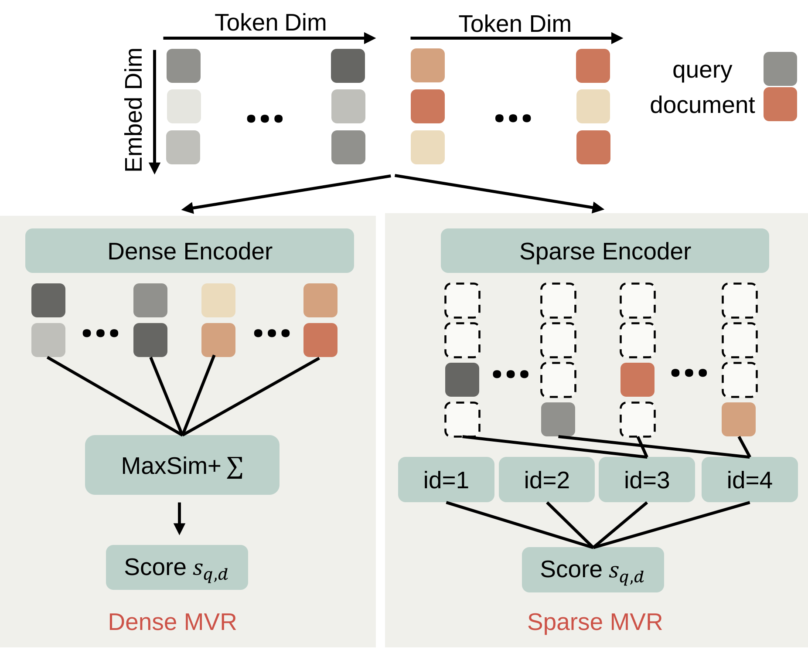

<div align="center">

<h1 style="font-family: Georgia; font-weight: 600; letter-spacing: 0.5px;">
✨ No More K-means: Single-Stage Sparse Coding for Efficient Multi-Vector Retrieval ✨
</h1>
<h3>ICML 2026</h3>

<br>

<p style="font-family: Charter, serif; font-size: 15px; line-height: 1.6; color: #444;">
<b>
<a href="https://veritas2024.github.io/" target="_blank"> Lixuan Guo</b><sup>*1,2</sup>,
<a href="https://yifeiwang77.com/" target="_blank"><b>Yifei Wang</b></a><sup>*3</sup>,
<a href="https://neilwen987.github.io/" target="_blank"><b>Tiansheng Wen</b></a><sup>4,1</sup>,
<a href="https://scholar.google.com/citations?user=hFhhrmgAAAAJ&hl=en"><b>Aosong Feng</b></a><sup>5</sup>,
<a href="https://people.csail.mit.edu/stefje/" target="_blank"><b>Stefanie Jegelka</b></a><sup>6,7</sup>,
<a href="https://chenyuyou.me/" target="_blank"><b>Chenyu You</b></a><sup>1</sup>
</p>

<p style="font-size: 14px; color: #555; margin-top: 8px;">
<sup>1</sup>Stony Brook University &emsp; 
<sup>2</sup>Xidian University &emsp;
<sup>3</sup>Amazon AGI SF Lab &emsp; 
<br>
<sup>4</sup>Georgia Tech &emsp;
<sup>4</sup>Yale University &emsp;
<sup>6</sup>TUM &emsp;
<sup>7</sup>MIT
</p>

<p>
  <a href="https://arxiv.org/abs/2605.30120">
    
  </a>
  <a href="https://y-research-sbu.github.io/SSR/">
    
  </a>
  <a href="https://huggingface.co/Y-Research-Group">
    
  </a>
</p>



<br>
<br>

</div>

## &#x1F680; &#x1F680; News
- 2026.06 Code released.
- 2026.05 Accepted by ICML2026.

## Setup

Install the project dependencies in the environment you use for training and retrieval. `pyproject.toml` is the single dependency source; use the `data` extra when you need preprocessing and the `eval` extra when you need accelerated retrieval kernels:

```bash
cd /home/ubuntu/Project/SSR
pip install -e ".[data,eval]"
```

## Data Preprocessing

Training data is prepared from MS MARCO passage:

```bash
python prepare_msmarco.py --subset passage
```

This writes `data/processed/msmarco/passage/` with `corpus.jsonl`, `queries/`, `qrels/`, `pairs/`, and `hard_negatives/`.

Evaluation data can be prepared from MS MARCO passage/document or from MTEB/BEIR-style retrieval tasks. For MS MARCO evaluation-only data, generate only the index files:

```bash
python prepare_msmarco.py --subset passage --skip-pairs --skip-hard-negatives
python prepare_msmarco.py --subset document --skip-pairs --skip-hard-negatives
```

For MTEB/BEIR evaluation data:

```bash
python prepare_mteb_eval.py --datasets nfcorpus scifact hotpotqa
```

This writes one directory per dataset under `data/processed/mteb/`, each with `corpus.jsonl`, `queries/{split}.tsv`, and `qrels/{split}.tsv`. More details are available in `docs`.

## Training

Train the standard token SAE for `SSR`:

```bash
python -m ssr.train \
  --dataset msmarco-passage \
  --data-dir data/processed/msmarco/passage \
  --sae-token-scope non-cls \
  --output-dir output/ssr-token
```

Train a separate `[CLS]` SAE for `SSR-CLS`:

```bash
python -m ssr.train \
  --dataset msmarco-passage \
  --data-dir data/processed/msmarco/passage \
  --sae-token-scope cls \
  --output-dir output/ssr-cls
```

The resulting token SAE checkpoint is used as `--model-path`; the `[CLS]` SAE checkpoint is passed to evaluation with `--cls-sae-path`. More details are available in `docs`.

## Evaluation

For a small direct retrieval run, use the sparse-cache backend:

```bash
python -m ssr.retrieval.eval_mteb \
  --task retrieval \
  --variant ssr \
  --model-path output/ssr-token/final \
  --dataset nfcorpus \
  --data-dir data/processed/mteb \
  --mode exact \
  --score-device index
```

For `SSR-CLS`, add the CLS SAE:

```bash
python -m ssr.retrieval.eval_mteb \
  --task retrieval \
  --variant ssr-cls \
  --model-path output/ssr-token/final \
  --cls-sae-path output/ssr-cls/final \
  --dataset nfcorpus \
  --data-dir data/processed/mteb \
  --score-device index
```

For larger corpora, build an end-to-end index first:

```bash
python -m ssr.retrieval.eval_mteb \
  --task index \
  --variant ssr \
  --model-path output/ssr-token/final \
  --dataset nfcorpus \
  --data-dir data/processed/mteb \
  --index-cache-dir data/cache/mteb_index_e2e/nfcorpus \
  --encode-device cuda:0
```

Then retrieve from the index:

```bash
python -m ssr.retrieval.eval_mteb \
  --task retrieval \
  --corpus-backend e2e-index \
  --variant ssr++ \
  --model-path output/ssr-token/final \
  --dataset nfcorpus \
  --data-dir data/processed/mteb \
  --index-cache-dir data/cache/mteb_index_e2e/nfcorpus \
  --score-device index \
  --index-accum-device hybrid
```

MS MARCO-style dataset slugs default to `MRR@10`; other retrieval datasets default to `nDCG@10`. More details are available in `docs`.

## Citing this paper

If you find this work useful, please cite the accompanying paper:

```
@inproceedings{guo26ssr,
    title={No More K-means: Single-Stage Sparse Coding for Efficient Multi-Vector Retrieval},
    author={Lixuan Guo and Yifei Wang and Tiansheng Wen and Aosong Feng and Stefanie Jegelka and Chenyu You},
    year={2026},
    booktitle={International Conference on Machine Learning (ICML)},
}
```

## Acknowledgements
This repository was built off of [CSR series](https://github.com/neilwen987/CSR_Adaptive_Rep) and [Pylate](https://github.com/lightonai/pylate). Thanks for their amazing works!
